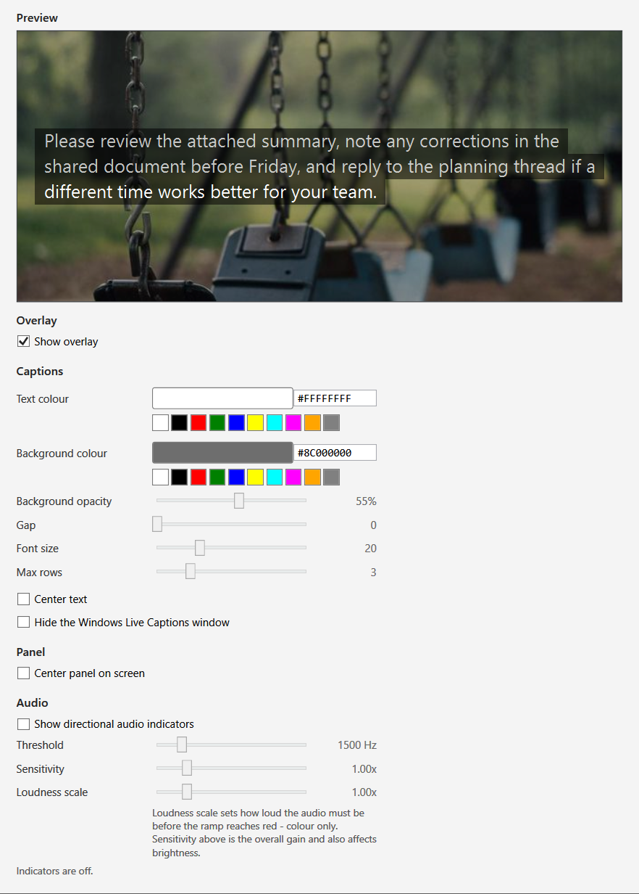

# BetterCaptions

A Windows overlay that mirrors Windows Live Captions over a fullscreen game, with optional directional audio indicators.



BetterCaptions is a small tray utility for people who are hard of hearing. It reads the text that Windows Live Captions is already producing and draws it on a caption panel that sits on top of a fullscreen game. It can also light a soft glow at the screen edge a sound came from. It was built for Counter-Strike: Source, but the overlay itself is not tied to that game: it is a topmost window that can be shown over anything. The only game-specific part is the optional auto-snap described below.

## Supporting this project

[](https://ko-fi.com/skillmaker)

BetterCaptions is free and MIT licensed. If it has been useful to you and you would like to say thanks, you can support me on Ko-fi: **https://ko-fi.com/skillmaker**

It is not expected. Bug reports, testing, and pointing someone who needs it at this project help just as much.

## Features

- Mirrors Windows Live Captions text onto an always-on-top caption panel over a fullscreen game.
- Optional directional audio indicators, off by default. Left/right are always shown; front, back and the four corners are shown when the output has more than two channels. On stereo output only left/right are shown.
- Indicator colour tracks loudness (quiet to loud: blue, yellow, orange, red). The indicator brightness is separate from the colour ramp.
- Live Options window with a preview that uses the same rendering rules as the overlay.
- Caption text colour, background colour and opacity, font size, number of visible rows, gap between rows and text alignment.
- The caption panel auto-sizes its width to its text up to a configurable maximum. Drag it to move it; hover it and use the right-edge grip to change the maximum width. It can be centred horizontally.
- The visible overlay can be made click-through, so clicks reach the game behind it. The panel cannot be moved while that is on.
- Option to move the real Windows Live Captions window off-screen so only the overlay's captions are visible. It is restored on exit.
- Tray icon: Show overlay, Hide overlay, Show options, Exit. Double-click the icon toggles the overlay.
- Global hotkey to toggle the overlay, changeable in the Options window. The default is Ctrl+Shift+O. If that combination is already taken, BetterCaptions tries a fallback list and persists the one that worked.
- The overlay snaps to the tracked game window and returns to the desktop full-screen area when the game window is minimized or gone.
- The overlay never activates, so it cannot take focus from the game.
- Settings are saved to `%LOCALAPPDATA%\BetterCaptions\settings.json`.

## Requirements

- Windows 11. This is a hard requirement because Windows Live Captions is a Windows 11 feature. BetterCaptions does not add an operating-system version check of its own; it depends on Live Captions being present.
- Windows Live Captions must be running for captions to appear. Press Win+Ctrl+L to start it. If it is not running, the panel shows a status message instead.
- For front/back and corner indicators, an output device with more than two channels (for example 5.1 or 7.1). On stereo output only left/right are shown.
- To build from source: the .NET 10 SDK.
- To run a self-contained release build: nothing else. Those builds need no .NET installation.
- To run a framework-dependent release build: the .NET 10 Desktop Runtime. It must be the Desktop Runtime, not just the base runtime, because BetterCaptions is a WPF app.

## Download & run

Download a build from the GitHub Releases page. Each release contains four single-file `.exe` builds: two architectures, each in a self-contained and a smaller framework-dependent flavour.

| File | Architecture | Needs .NET installed | Approx. size |
| --- | --- | --- | --- |
| `BetterCaptions-win-x64.exe` | Intel / AMD | No | 72 MB |
| `BetterCaptions-win-arm64.exe` | Windows on Arm | No | 68 MB |
| `BetterCaptions-win-x64-requires-dotnet.exe` | Intel / AMD | Yes, the .NET 10 Desktop Runtime | 1.5 MB |
| `BetterCaptions-win-arm64-requires-dotnet.exe` | Windows on Arm | Yes, the .NET 10 Desktop Runtime | 1.4 MB |

- `win-x64` is for most Intel and AMD PCs. `win-arm64` is for Windows on Arm devices, such as Snapdragon-based machines.
- The **self-contained** builds bundle the .NET runtime and need nothing installed.
- The **`requires-dotnet`** builds are about fifty times smaller, but they only start if the [.NET 10 Desktop Runtime](https://dotnet.microsoft.com/download/dotnet/10.0) is already installed. If it is missing, Windows reports that when you try to run the file.

If you are not sure which one you need, pick `BetterCaptions-win-x64.exe`.

Run the `.exe`. It starts with no window: only a tray icon appears. Start Windows Live Captions with Win+Ctrl+L, then show the overlay from the tray icon or with the hotkey.

## Build from source

Install the .NET 10 SDK, then from the repository root:

```
dotnet build src/BetterCaptions/BetterCaptions.csproj
dotnet run --project src/BetterCaptions/BetterCaptions.csproj
```

The solution file is `BetterCaptions.sln`. The only project is `src/BetterCaptions/BetterCaptions.csproj`, which targets `net10.0-windows` and uses WPF, WinForms (for the tray icon) and NAudio (for audio capture).

## Usage

### Tray icon

Left-double-click the tray icon to toggle the overlay. Right-click for the menu:

- Show overlay
- Hide overlay
- Show options
- Exit

The tray tooltip shows the currently bound hotkey. BetterCaptions has no main window of its own; it runs from the tray and exits only when you choose Exit (or from the task manager).

### Global hotkey

The default hotkey is **Ctrl+Shift+O**. It toggles the overlay. The hotkey is system-wide.

If Ctrl+Shift+O is already registered by another application, BetterCaptions tries these in order and persists the first one that works:

1. Ctrl+Alt+O
2. Ctrl+Shift+F10
3. Ctrl+Alt+Shift+O
4. Ctrl+Alt+F10

A tray balloon reports which combination was bound. If none of them can be registered, the app keeps running and the tray icon remains the way to toggle the overlay.

The hotkey is stored in `settings.json` and can be changed in the Options window: click the hotkey box and press the new combination. It is registered and saved immediately, and the tray tooltip updates to match. At least one of Ctrl, Alt or Shift is required; a bare key is refused, because registering it would swallow that key in every other application. If the combination is already taken by another app, the previous hotkey stays in force and the window says so.

### Options window

Open it from the tray menu (Show options). It is a normal desktop window, not an overlay, and it is never topmost. Changes are saved and applied immediately. It has six sections:

- **Preview**: sample caption text rendered with the same wrapping and row rules the overlay uses, over a photo backdrop.
- **Overlay**: a Show overlay checkbox, kept in step with the tray and hotkey.
- **Hotkey**: shows the bound combination and lets you set a new one by pressing it. At least one of Ctrl, Alt or Shift is required.
- **Captions**: text colour, background colour, background opacity, gap, font size, max rows, center text, and hiding the Windows Live Captions window.
- **Panel**: centres the overlay panel horizontally, and a click-through option for the visible overlay.
- **Audio**: directional audio indicators on/off, threshold, sensitivity, loudness scale, and a live capture status line.

### Click-through

"Click through the visible overlay" (Panel section) makes the shown overlay pass mouse clicks through to the game underneath, so you can press a game button that is behind the caption panel without hiding it first. While it is on, the panel cannot be dragged or resized, because those need mouse input; turn the option back off in the Options window to move the panel again. The window can always be opened from the tray icon, so this is never a one-way trip.

### Overlay panel

- Drag the panel with the left mouse button to move it. The X/Y offset is saved.
- Hover the panel to reveal a grip on the right edge; drag it to change the panel's maximum width.
- When "Center panel on screen" is on, the panel is centred horizontally and only its vertical position follows the drag.

## Settings reference

Settings live in `%LOCALAPPDATA%\BetterCaptions\settings.json`. Most are editable in the Options window; the rest can only be changed by editing that file. Values from a hand-edited file are clamped to a safe range by the app.

| Setting | Default | Where | What it does |
| --- | --- | --- | --- |
| `OverlayVisible` | `false` | Options / tray / hotkey | Whether the overlay is shown. The app starts hidden by default and honours this value on the next launch. |
| `ClickThroughWhenIdle` | `true` | settings.json | Makes the overlay window click-through while it is hidden, so it cannot intercept input when not shown. |
| `ClickThroughWhileVisible` | `false` | Options (Panel) | Keeps the visible overlay click-through, so clicks pass through the panel to the game behind it. The panel cannot be dragged or resized while this is on. |
| `OverlayOpacity` | `0.9` | settings.json | Present in the settings model but not read by any current code path. Changing it has no effect. |
| `PanelX` | `0` | drag | Panel left offset in device-independent pixels, saved when the panel is dragged. |
| `PanelY` | `0` | drag | Panel top offset in device-independent pixels. |
| `PanelMaxWidth` | `640` | width grip | Maximum panel width in device-independent pixels. The panel fits its text up to this cap. |
| `PanelCenteredHorizontally` | `true` | Options (Panel) | Centres the panel horizontally; the vertical position is unchanged. |
| `CaptionTextColor` | `"#FFFFFFFF"` | Options (Captions) | Caption text colour as `#AARRGGBB`. Older rows use the same colour at about 75% alpha. |
| `CaptionBackgroundEnabled` | `true` | settings.json | When false, caption bars paint no background at all. |
| `CaptionBackgroundColor` | `"#8C000000"` | Options (Captions) | Caption bar colour. The Options window edits the colour and the background opacity slider edits the alpha channel. |
| `CaptionFontSize` | `20` | Options (Captions) | Caption glyph size in device-independent pixels. Slider range 12 to 40. |
| `CaptionLineGap` | `0` | Options (Captions) | Extra vertical space between caption rows, in device-independent pixels. Slider range 0 to 30. |
| `CaptionMaxRows` | `3` | Options (Captions) | Maximum number of caption rows shown. Slider range 1 to 10. Reduced if the full window would not fit the work area. |
| `CaptionTextCentered` | `true` | Options (Captions) | Centres each caption row within the panel instead of leaving rows flush left. |
| `HideLiveCaptionsWindow` | `false` | Options (Captions) | Moves the real Live Captions window off the visible desktop while BetterCaptions runs, so only the overlay's captions are visible. It keeps running, and is restored on exit. |
| `ShowOnlyWhenGameRunning` | `false` | settings.json | Shows the overlay only while a tracked game window exists. |
| `HotkeyCtrl` / `HotkeyShift` / `HotkeyAlt` / `HotkeyKey` | `true` / `true` / `false` / `0x4F` | Options (Hotkey) | The global hotkey. The defaults are Ctrl and Shift with virtual-key `0x4F`, which is the letter O: Ctrl+Shift+O. Changeable from the Options window. |
| `AudioIndicatorsEnabled` | `false` | Options (Audio) | Turns the directional audio indicators on. Off by default. |
| `AudioThresholdHz` | `1500` | Options (Audio) | High-pass cutoff in Hz. Only energy above this frequency can light an indicator. Slider range 200 to 8000. |
| `AudioSensitivity` | `1.0` | Options (Audio) | Linear gain applied before the dB mapping. Affects both indicator brightness and colour. Slider range 0.25 to 4. |
| `AudioLoudnessScale` | `1.0` | Options (Audio) | How loud the audio must be before the colour ramp reaches red. Colour only; brightness is unaffected. Slider range 0.25 to 4. |

## Notes and limitations

- BetterCaptions is an unofficial tool. It is not affiliated with, endorsed by, or supported by Valve or Microsoft.
- BetterCaptions does not inject code into the game, does not hook graphics APIs, and does not read another process's memory. It gets the caption text by polling the Windows Live Captions window through Windows UI Automation: it finds the `LiveCaptions` process and its window, locates the caption text element by its automation ID, and reads that element's name. This is a read-only accessibility API.
- This is not a claim that BetterCaptions is "anti-cheat safe", undetectable or VAC-safe. Because it does not inject or hook, it does not modify the game process, but that says nothing about how any particular anti-cheat system treats it. Use it at your own discretion.
- The Live Captions process name, window class and automation IDs are internal Windows implementation details. They can change with a Windows update, and BetterCaptions would then stop reading captions until it is updated. Failures in the reader are reported as a status message rather than a crash.
- Windows Live Captions must be running for captions to appear. BetterCaptions does not start it for you.
- The directional indicators rely on capturing the default output device with WASAPI loopback in shared mode. If the device is held in exclusive mode by another application, capture is not possible; the Options status line says so. Muted or silent output is also reported as a status hint. The indicator direction comes from the output channel layout, so stereo output cannot resolve front, back or the corners.
- The optional game-window auto-snap only recognises the Counter-Strike: Source and Source engine window process names (`cstrike_win64`, `cstrike`, `hl2`). The overlay itself is not restricted to those games; you can show it over anything.
- The app starts hidden. If the overlay does not appear, check the tray icon and the bound hotkey in the tray tooltip.

## License

MIT. See [LICENSE](LICENSE).
